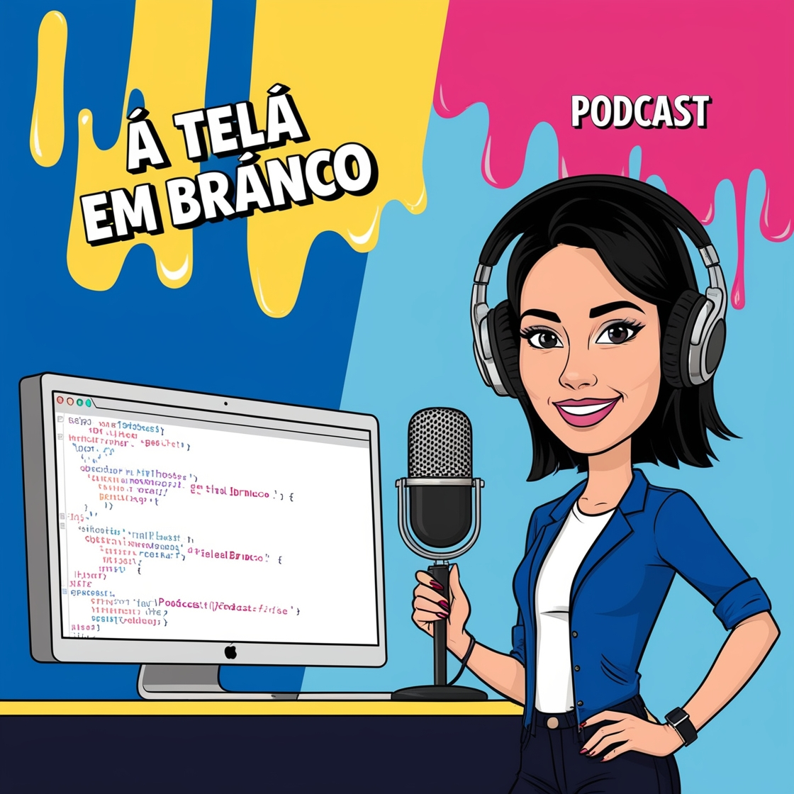

# Projeto Podcast Gerado por I.A.s

Projeto com o objetivo de gerar um podcast utilizando ferramentas de IA através de prompts mais trabalhados.

Utilizei uma esteira de prompts para gerar cada etapa do processo criativo.

## 📚 Onde ouvir o podcast
[Episódio 1: Começando do Zero com Lógica de Programação] (https://www.notion.so/Epis-dio-1-Come-ando-do-Zero-com-L-gica-de-Programa-o-189dd4000fac815f83d7fd23a551708e?pvs=4)

## 💻 Tecnologias utilizadas no projeto

- [ChatGPT](https://chat.openai.com/) 
- [Leonardo AI](https://www.Leonardo.ai/)
- [TTS Maker](https://ttsmaker.com/br/)
- App Youcut
- App Super Sound

## ✨ Como foi feito ?

- Roteiro gerado via chatgpt
- Audio gerado pela TTS Maker
- Leonardo AI Para gerar capas
- Youcut para montar video com os aúdios e adicionar sons de fundo.
- Super sound para converter video em áudio

---
